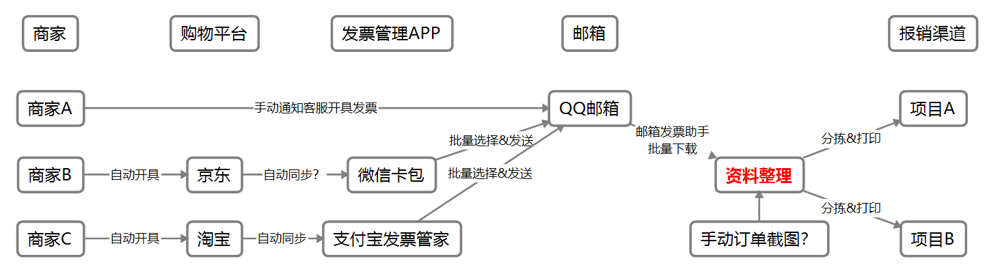
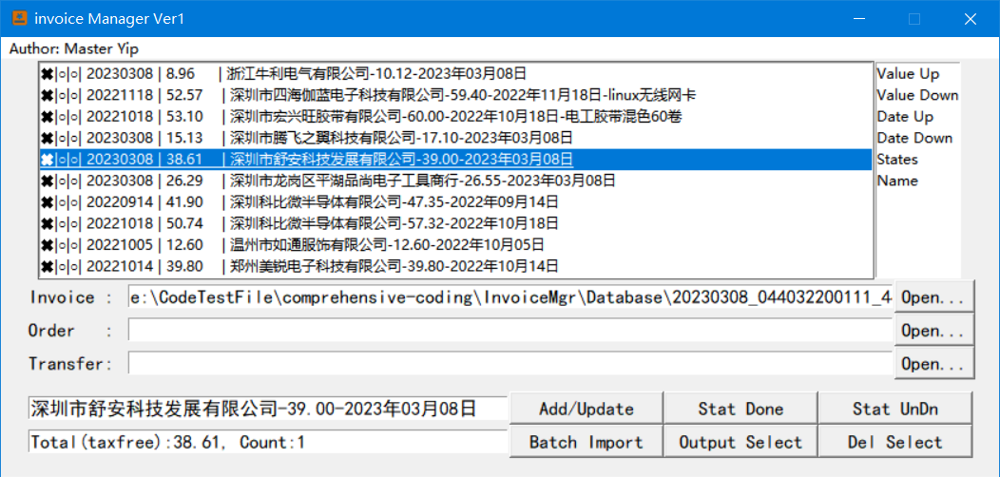
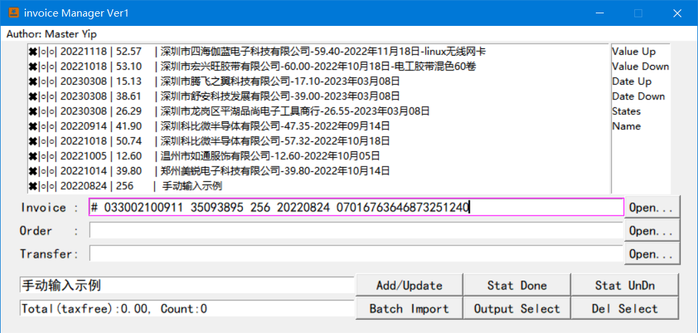
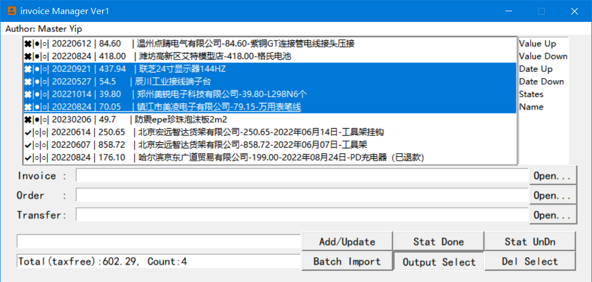
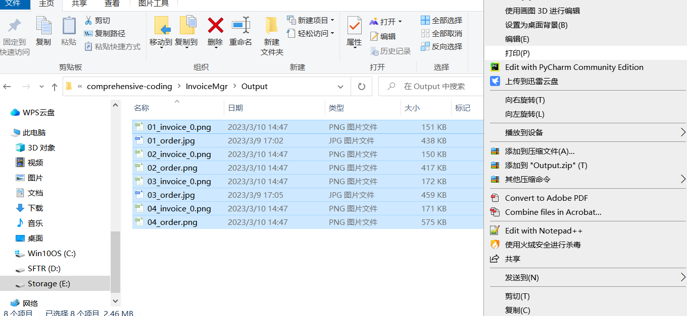
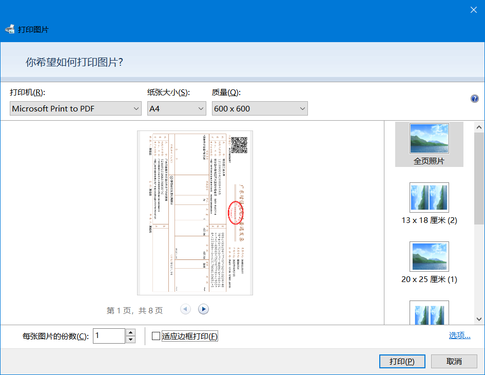
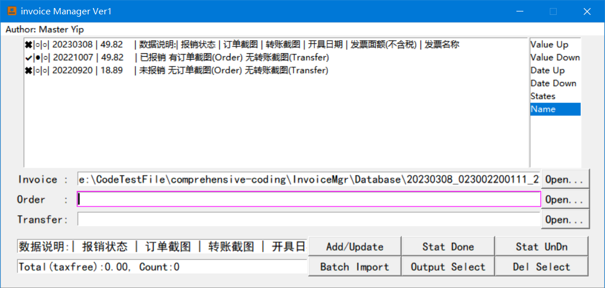

# InvoiceMgr

（注：本说明部分内容使用ChatGPT生成，如存在疏漏欢迎在issue中提出）

这是一个用于管理发票信息的简单软件，可以添加、删除、更新发票信息，并且可以通过按值或按日期等方式排序发票列表。该软件还提供了一些实用功能，如通过批量导入、设置输出目录和状态来更方便地管理发票。

## 背景

学校项目的报销极其繁琐，写这个软件的目的是希望简化从发票开具——报销资料（发票、订单截图、转账截图）整理打印——报销提交报销的流程。

一般的报销流程如下所示：

其中最占用时间的是**报销资料收集**、**资料整理分拣打印**。InvoiceMgr主要提供了**资料整理**功能。由于报销资料收集渠道复杂，目前尚未实现自动化处理。

## 功能介绍

### 发票导入/导出
用户可以通过在软件中添加发票来管理自己的发票，添加发票时需要填写发票的相关信息，包括：发票代码、发票号码、开票日期、发票名称、发票金额等。

1. 本软件支持拖拽导入发票，用户可以直接将文件拖拽到软件窗口地址栏中即可导入。

2. 通过发票pdf文件导入：通过"Open..."选择相应的pdf发票文件，软件将自动读取发票二维码信息并添加入库。

    **注：从深圳开具的部分发票由于格式与全国并不统一，无法正常导入。**

3. 手动添加发票信息（针对纸质发票）：用户可以通过输入名称、日期、价值和状态来添加新的发票信息。示例如下：
    Format "# 发票代码 发票号码 发票面额 开具日期 验证码"
    e.g. "# 033002100911 35093895 256 20220824 07016763646873251240"

4. 订单截图Order与转账截图Transfer仅支持jpg/png格式。

#### 批量导入发票(Batch Import)
用户可以通过批量导入多个发票，快速地将多张发票添加到软件中。软件仅支持导入PDF格式的发票，并自动识别并提取发票信息。

#### 批量导出发票(Output Select)
用户可以将已经添加的报销资料批量导出图片至输出目录，方便用户打印报销资料。

若需要打印为pdf，全选后在第一张图片右键单机打印即可。

注：用户可以修改`config.json`文件将报销所需文件输出到指定目录。

### 发票管理
用户可以对已经添加的发票进行分类管理，对于同一种类的发票可以进行批量操作，包括：删除、排序、标记为已处理等。

#### 数据说明

#### 更新(Add/Update)&删除(Del Select)
-   更新发票：用户可以选中一个发票并更新其相关信息。
-   删除发票：用户可以选中一个或多个发票并删除（注意是永久删除，不可撤销）。
#### 发票排序
-   按值排序(Value Up/Down)：用户可以按照发票的价值排序列表，从而更容易找到最有价值的发票。
-   按日期排序(Date Up/Down)：用户可以按照发票的日期排序列表，从而更容易找到最近的发票。
-   按状态排序(States)：用户可以按照发票的状态（已报销或未报销/是否存在订单截图等）排序列表，从而更容易找到需要处理的发票。
-   按名称排序(Name)：用户可以按照发票的名称排序列表。
#### 状态设置
-   设置状态：用户可以将一个或多个发票的状态设置为“已报销”或“未报销”，以更好地追踪发票处理情况。

## 安装与使用

### 源码运行
本软件基于Python 3开发，运行环境需要安装相应的依赖库。在命令行下进入本软件的根目录后，运行以下命令安装依赖：

1.  安装 Python 3.6+ 环境及以下依赖库：
    `pip install PyMuPDF pyzbar pillow windnd json5`
    或
    `pip install -r requirements.txt`
    
2.  运行以下命令：
    `python invoice_manager.py`

### 发布版本
解压后双击InvoiceMgr.exe即可。

## 注意事项
1.  本软件默认将发票图片导入到软件所在文件夹下的 `Output` 文件夹中，并将发票信息储存到 `Database` 文件夹中。用户可以通过编辑 `config.json` 文件更改导入路径。
2.  本软件仅支持读取发票二维码信息，不支持识别发票其他信息，如需其他信息，请自行扩展。

## 开发者信息

-   作者：Master Yip
-   版本：Ver1.0
-   开发语言：Python 3
-   依赖库：os, logging, datetime, json, shutil, tkinter, windnd, fitz, pyzbar, PIL

## 参考资料
1.  PyMuPDF：[https://github.com/pymupdf/PyMuPDF](https://github.com/pymupdf/PyMuPDF)
2.  pyzbar：[https://github.com/NaturalHistoryMuseum/pyzbar](https://github.com/NaturalHistoryMuseum/pyzbar)
3.  Pillow：[https://github.com/python-pillow/Pillow](https://github.com/python-pillow/Pillow)
4.  windnd：[https://github.com/cilame/windnd](https://github.com/cilame/windnd)

